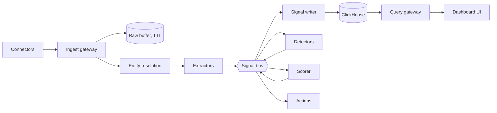
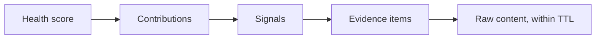

# Yochō: Kizashi Module Plan

Sep 26, 2026 · @Chris Watkins

## Scope

Yochō is the churn early-warning module of Kizashi. It adds signal extraction, entity attribution, health scoring, lineage drill-down, a case library and an analyst workbench on top of Kizashi's ingestion, gateways, storage and console. Signals are generic, so customer health is the first monitoring pack and others plug in later. License: MIT. Target: containers on Azure.

Sources: Office 365 email (about 100 mailboxes, extensible by group membership), Zendesk, calls, ERP orders, and AR. Email and Zendesk are built first. The goal is advance warning of churn, where churn means a customer stops ordering.

## Kizashi integration

Yochō reuses Kizashi's platform and adds churn-specific stages after normalization. Eight decisions conflict with Kizashi's current design and must be closed before Phase 0.

**Reused from Kizashi**

| Kizashi component | Yochō use |
| --- | --- |
| Ingestion agents (MS Graph Mail, Zendesk, Direct SQL, Fabric, generic API) | Email, Zendesk, ERP and AR sources; extended for Yochō needs |
| Ingestion Gateway | Entry point for all Yochō sources |
| Normalization (rule-driven per source) | Runs before Yochō extractors |
| RabbitMQ event bus | Signal bus |
| Postgres | Signal registry, entity graph, config, case library |
| ClickHouse | Signal tables and rollups |
| Azure AI Foundry and Azure ML | Escalation tier and model training |
| Triggered actions | Alerts and routing |
| Query Gateway and console | Dashboards, drill-down, workbench screens |
| Auth (Entra ID, local, generic OAuth) | Identity; Yochō adds BU and account scoping |

**Added by Yochō**

- Transport capture path and Graph behavior delta on the mail agent; webhook nudges on the mail and Zendesk agents.
- Entity resolution with review queue; signal extractors; detectors; scorer.
- Lineage, thread and ticket skeletons, commitment ledger.
- Churn labels, case library, workbench, replay and shadow mode.
- Console screens, added to the Kizashi Console UI specification.

**Conflicts to decide**

| Area | Kizashi today | Yochō plan | Options |
| --- | --- | --- | --- |
| Raw data retention | Schema-on-read raw storage kept | Raw only in a TTL buffer; signals kept | Kizashi model wins; Yochō model wins; per-source policy |
| Cloud portability | Azure and AWS; no cloud-native-only services | Key Vault, Azure ML, Exchange RBAC for Applications | Put key management, training and model hosting behind traits; or accept Azure-only for Yochō |
| Connector triggering | Scheduled CronJobs | Webhook nudge plus delta | Add a nudge path to Kizashi agents; or poll only |
| Privacy | Not specified | Crypto-shredding | Platform-wide; or Yochō data only |
| Event storage | Postgres for hot and events, ClickHouse for aggregates | Signals in ClickHouse, append-only | Signals as a new ClickHouse tier; or as Kizashi events |
| Retention and archival | Platform retention, archival, reimport | Downsampling tiers, pinned lineage | Extend platform policy with signal tiers |
| Local dev | Docker Compose | Podman compose | Keep Kizashi's compose file, run with either |
| Repository | Kizashi codebase | Standalone `customer-health` workspace | Yochō crates inside the Kizashi workspace; or separate repo depending on Kizashi crates |

Recommendation on raw retention: per-source policy, since Kizashi's replay, labeling and drill-down benefit from raw data while the TTL keeps PII and storage bounded for mail content.

## Decisions agreed

| Area | Decision |
| --- | --- |
| Language | All Rust for everything we own and run |
| Extensibility | Packs compiled in as crates behind core traits; WASM deferred |
| Model training | Azure ML / Foundry |
| Model inference | Local ONNX via `ort`; Foundry LLM only for escalation |
| Foundry access | `ModelProvider` trait with a Rust router: PTU first, spill to pay-as-you-go, priority classes |
| Email capture | Hybrid: transport forwarding for content, Graph delta for behavior |
| Forwarding target | Buffer only: extract, then purge on TTL |
| Mailbox scope | Mail-enabled security group via Exchange RBAC for Applications |
| Signals | Append-only, never discarded; deletes, moves and reads are events |
| Retention | Full resolution for a hot window, then downsampled rollups |
| Signal store | ClickHouse |
| Control plane | Postgres (registry, packs, entity maps, dashboards, auth) |
| Privacy | Crypto-shredding with per-subject keys in Key Vault, plus hard delete where cheap |
| Dashboards | In the Kizashi console, bound to the signal registry |

Also agreed: churn is a customer no longer ordering, and the order stop is the training label rather than an alert signal; analysts work through point-and-click tools with no hand-authored rules; email and Zendesk are the first integrations.

## Pipeline

Each stage is its own container; stages talk over a signal bus, and nothing downstream of extraction sees raw content.



| Stage | Responsibility |
| --- | --- |
| Connectors | Scheduled pulls and webhook nudges; know sources, not packs |
| Ingest gateway | Auth, dedup on source identity, write to raw buffer |
| Entity resolution | Map items to entities (email, contact, account); first-class stage |
| Extractors | Raw to typed signals; local ONNX tier, Foundry escalation tier |
| Signal writer | Bus to ClickHouse; registry drives rollups and TTL |
| Detectors | Per-entity baselines and anomaly flags, emitted as signals |
| Scorer | Composite scores with per-input contributions, emitted as signals |
| Actions | Rules on signals and scores fire alerts, webhooks, tasks |
| Query gateway | `axum`; compiles panel definitions to ClickHouse SQL |

Signal bus is Kizashi's RabbitMQ. Connectors, ingest gateway, actions and query gateway are Kizashi components; entity resolution, extractors, signal writer, detectors and scorer are added by Yochō.

## Email ingestion

Transport capture is the content source of truth; Graph delta on each mailbox supplies behavior only. The two join on `internetMessageId`.

**Content path (transport)**

- Mail flow rule forwards matching mail to a central buffer; journaling cannot target an Exchange Online mailbox.
- Captures replies from any mailbox in the tenant, closing the unmonitored-mailbox blind spot.
- Immune to user deletes and folder moves.
- Buffer is purged on TTL after extraction.

**Behavior path (Graph)**

- `mailFolders/delta` discovers folders; message delta per folder, metadata properties only.
- Webhook change notifications act as nudges; delta is the source of truth, with a periodic sweep as safety net.
- Immutable IDs (`Prefer: IdType="ImmutableId"`) for Graph operations.
- A move is a remove plus add with the same `internetMessageId`: a location update, not a new message. A grace window reconciles out-of-order events.
- A lone remove after the grace window is a delete event. Read, flag and category changes are events too.

**Mailbox scope**

- App granted `Mail.Read` (application), scoped to a mail-enabled security group via Exchange RBAC for Applications.
- Connector enumerates the group on a schedule; adding a mailbox means adding it to the group.

**Email-specific stages**

1. Dedup on `internetMessageId` (CC copies across mailboxes).
2. Threading via `conversationId`, `In-Reply-To`, `References`; Sent Items required.
3. Body cleanup: strip quoted replies, signatures and disclaimers before extraction.
4. Entity resolution: domain to account, contact to account.

**Risk:** Online Archive retention moves look like deletes; Graph support for archive mailboxes is limited and must be verified.

## Zendesk ingestion

Same pattern as email: webhooks nudge, cursor-based incremental export is the source of truth.

**Pull (source of truth)**

- `GET /api/v2/incremental/tickets/cursor.json` with the cursor stored in Postgres in the same transaction as the ingest write; up to 1,000 tickets per page ([Zendesk docs](https://developer.zendesk.com/rest_api/docs/core/incremental_export)).
- Ticket events export for state transitions, and incremental users and organizations exports for entity matching.
- Per ticket: comments (public and internal), ticket metrics, satisfaction ratings.
- Incremental exports have their own limit of 10 requests per minute, 30 with the High Volume add-on; read the rate-limit headers and throttle proactively ([Knit](https://getknit.dev/blog/zendesk-ticketing-api/)).
- The most recent minute is never returned, so the connector lags by at least one minute.

**Push (nudge)**

- Zendesk webhook fired by a trigger on ticket create and update; triggers an immediate incremental pull. Missed webhooks self-heal on the next scheduled pull.

**Edge cases**

- Deleted tickets stay in exports, but their content is scrubbed 30 days after deletion ([Zendesk docs](https://developer.zendesk.com/documentation/ticketing/managing-tickets/using-the-incremental-export-api)). Ingest before scrub; a delete becomes an event, per the append-only rule.
- Archived tickets are reported to be excluded from incremental exports ([eesel](https://www.eesel.ai/blog/zendesk-api-incremental-export)); backfill of old closed tickets may need a separate path. Verify against our instance.
- Idempotent writes: the same ticket version can arrive twice.

**Mapping**

- Zendesk organization to customer; requester email to contact. Unmapped requesters go to the entity review queue.
- Comment bodies go through the same cleanup and extraction path as email; a ticket that started as an email is deduped against the email thread.

**Auth:** OAuth client or API token, stored in Key Vault. Choice is open.

## Calls and ERP orders

Both are planned sources; neither system has been named yet, so connector design here is the pattern, not the implementation.

**Calls**

- Ingest call metadata (who, when, duration, direction, missed or answered) and transcripts where available.
- Transcripts go through the same cleanup, sentiment, urgency and commitment extraction as email.
- If the phone system produces audio only, transcription is an added stage (Foundry speech or a local model); decision open.
- Signals: call frequency trend, missed inbound calls, callback delay, sentiment per call.

**ERP orders**

- Orders are the label source for churn and the order-drift signals; they are also required for backfill depth.
- Pull by incremental key (last-modified timestamp or change log) where the ERP supports it; otherwise scheduled snapshots with change detection.
- Order lines keyed by ERP customer number, mapped through entity matching to customer and BU.
- AR (invoices, payments, days past due) comes from the same ERP or billing system; connector shared if so.

**Pending:** phone system, ERP/OMS product, AR/billing system, and how far back order history goes.

## Entity matching and attribution

Every signal must resolve to a customer and BU; matching is a first-class service with a human review queue.

**Entity graph (Postgres):** contact, customer, BU, parent/subsidiary links. Many-to-many: one contact can span customers, and generic domains are ambiguous.

**Identifiers per source**

| Source | Identifiers |
| --- | --- |
| Email | Sender and recipient addresses, domains |
| Zendesk | Organization ID, requester email |
| Calls | Phone numbers, caller ID, linked contact |
| ERP / AR | Customer number, bill-to and ship-to |

**Matching tiers**

1. Deterministic: ERP customer number, Zendesk organization, known contacts, owned domains.
2. Probabilistic: name and domain similarity, co-occurrence across sources, with a confidence score.
3. Review queue: unmatched and low-confidence items; admin decisions become deterministic rules.

**Attribution timing** (decision open)

| Approach | Pros | Cons |
| --- | --- | --- |
| Bake `customer_id` into the signal at write | Fastest queries | Wrong or late matches are wrong forever |
| Late binding via versioned mapping joined at query time (ClickHouse dictionaries) | Fixing a match heals all history | Slower queries; dictionary refresh to manage |
| Hybrid with correction events | Fast reads, fixable | Rollups need recompute on correction |

Recommendation: late binding.

**Entity dedupe:** duplicate customers across ERP, CRM and Zendesk get merge and split tooling in the admin console, feeding the same review queue.

**Pending:** whose BU (ours, the customer's, or both), and the source of truth for customers and BUs.

## Customer health signals

All signals are in scope. The strongest early ones are reply behavior, urgency, and late payment.

**Reply tracking (per-thread state machine)**

- Inbound external message opens "awaiting response"; an outbound reply resolves it; a customer follow-up while open escalates it.
- Clock runs on business hours against an SLA from config.
- Deleting an unanswered inbound does not resolve the thread; it emits "dismissed without response".
- Header rules (`Auto-Submitted`, `Precedence: bulk`, `X-Auto-Response-Suppress`, OOF) plus a local "reply expected?" classifier filter out mail that needs no reply.

| Signal | Source |
| --- | --- |
| Time to first response | Transport |
| Open unanswered count per account | Transport |
| Oldest open thread age | Transport |
| Customer chase count | Transport + urgency classifier |
| Participant change (sponsor quiet, manager CC'd) | Transport |
| Read, not replied after N hours | Graph behavior |
| Deleted unanswered | Graph behavior |
| Flagged then ignored | Graph behavior |
| Urgency category | Extractor |
| Sentiment and embedding drift | Extractor |
| Days past due, days-to-pay trend | AR/billing connector |

**Urgency and intent**

- Categories: billing dispute, service failure, cancellation or competitor mention, escalation, legal or contractual.
- Layered: high-precision rules, then a local classifier on everything, then Foundry on flagged items to confirm and extract details.
- Urgent plus unanswered plus past SLA fires an alert immediately. Tune alerts for precision, dashboards for recall.

**Health score**

1. v1: weighted rules over signals, fully explainable.
2. v2: detector outputs added as inputs.
3. v3: supervised churn model trained in Azure ML, run locally as ONNX; needs churn/renewal labels.

**Trend discovery**

- Embed locally, cluster per window, track cluster size over time; one Foundry call per new cluster to name it.
- A topic rising across many accounts is a product or ops issue, handled by a separate detector.
- Re-clustering reaches back only as far as the raw buffer TTL.

## Commitments, sentiment, and cross-source signals

The leading indicators of churn are broken promises, worsening tone, and slow responses; these are measured across every source, not just email.

**Commitment ledger**

- Extract customer asks (what, by when) and our commitments ("revised pricing Friday") per thread, ticket and call.
- States: open, fulfilled, broken, unknown.
- Fulfilled evidence: our follow-up delivering it, customer acknowledgment, or another system (ticket solved, credit issued, order changed).
- Broken evidence: due date passed with no evidence, or the customer re-asks. Re-ask is the strongest single tell.
- Local classifier gates on "contains ask or promise"; only those go to Foundry for structured extraction.
- Users can mark "fulfilled elsewhere" in drill-down; that becomes a training label.
- Per-rep promise tracking is open (HR and adoption implications).

**Sentiment**

- Baseline per contact and per customer; signal on deviation and trajectory, not absolute level.
- Frustration markers ("again", "still", "as I said", manager CC'd) are a separate classifier.
- Response delay weighted by the urgency of the ask.

**Signals by source**

| Source | Signals |
| --- | --- |
| Email | Reply latency, unanswered count, chase count, sentiment drift, frustration, participant change, commitments |
| Zendesk | First reply and resolution time, reopens, SLA breaches, CSAT and its trend, ticket volume trend, priority and escalation, commitments |
| Calls | Call frequency trend, missed inbound, callback delay, sentiment, commitments |
| ERP orders | Order frequency vs baseline cadence, volume trend, product mix narrowing (early drift only; see labels) |
| AR | Days past due, days-to-pay trend, partial payments, disputes |

Cross-source: the same issue raised by email, then a ticket, then a call is one issue escalating, not three; content dedupe links them.

## Churn labels and case library

Churn means a customer stops ordering. The order stop is the label, the answer key; the product's job is to warn well before it.

**Label derivation (configurable in the workbench)**

- Churned when there are no orders for N times the customer's normal ordering interval, with seasonality accounted for.
- Churn date is the last order date; confirmed once the inactivity window passes.
- Censoring: customers whose window has not elapsed are excluded from training and evaluation.
- Reactivation makes labels revisable, so labels are versioned; golden sets pin a label version.
- Partial churn: sustained volume decline is its own case type.

| Label rule | Pros | Cons |
| --- | --- | --- |
| Fixed inactivity window | Simple, explainable | Mislabels infrequent orderers; misses fast orderers drifting off |
| Cadence-relative | Accurate across customer types | Needs order history; new customers unlabelable for a while |
| Hybrid, cadence-relative with floor and ceiling | Handles sparse history | More parameters to tune |

**Case library**

1. Cases come from derived labels, or an analyst marks one in the UI. Near-misses (at risk but saved) are marked too.
2. The lineage engine reconstructs each case's lookback timeline: signals, scores, thread skeletons, tickets, calls, AR events.
3. Analysts annotate the timeline ("this is where it went wrong").
4. Datasets use matched controls: retained customers from the same BU, segment and size in the same period.
5. Features are point-in-time correct: what the system knew then, with the extractor and config versions of the time.
6. Golden sets are frozen, versioned evaluation sets; every model and score version runs against them.

**Early warning, not detection**

- Evaluation cuts features off at churn date minus the horizon; order-decline features inside that final window are excluded.
- The drift start (when ordering began deviating from baseline) serves as the decision-date proxy for leakage control.
- Headline metric: lead time in days at an acceptable false-alarm rate.
- Longer horizon means earlier warning but lower accuracy; the business picks the point.

**Synthetic timelines:** perturbed real cases for stress-testing detectors only, never for training.

**Pending:** prediction horizon (30, 60 or 90 days), churn per customer or also per BU, seasonality, and treatment of returning customers.

## Signal storage and retention

Signals are append-only rows in one narrow ClickHouse table; state changes are new events, never updates.

**Signal row:** `entity_type`, `entity_id`, `signal_type`, `ts`, `value`, `dims` (map), `extractor_version`, encrypted provenance.

**Signal registry (Postgres):** name, value type (gauge, counter, categorical, score), unit, producing extractor, rollup rules, retention tier. Adding a signal is a registry entry plus an extractor, with no schema migration.

| Tier | Resolution | Mechanism |
| --- | --- | --- |
| Hot | Full resolution | Primary ClickHouse storage |
| Warm | 1h rollups | `TTL ... GROUP BY` |
| Cold | 1d rollups | Storage policy moves parts to Azure Blob |
| Archive | Yearly Parquet export | Blob Cool/Archive tier |

**Compression**

- Codecs: `DoubleDelta` on timestamps, `Gorilla` on float gauges, `Delta` on counters, `LowCardinality` on type columns, `ZSTD` underneath.
- Percentiles as t-digest or DDSketch state, distinct counts as HyperLogLog, stored in `AggregateFunction` columns so rollups of rollups stay correct.

**Embeddings:** not persisted per message beyond the raw buffer. Persist per-entity window centroids and drift distance as a scalar signal.

Hot window length and raw buffer TTL are open items.

## Models and Foundry

Models are trained in Azure and run in our containers; Foundry serves only the LLM escalation tier.

**Local inference**

- `ort` loads Azure-exported ONNX directly; the ONNX Runtime shared library ships in the image.
- Local tier covers sentiment, embeddings, the "reply expected?" classifier, the urgency classifier, and the v3 churn model.
- Classifier bootstrap: Foundry LLM labels a sample of real mail, Azure ML trains a small model on those labels, export to ONNX.

**Foundry escalation**

- Confirms urgency categories and extracts details (amount, deadline, who); names new trend clusters.
- Called over HTTP with `reqwest`; auth through `azure_identity` with managed or workload identity, no API keys.

**`ModelProvider` router**

- PTU deployment first for latency-sensitive and steady work.
- On 429 or utilization over threshold, spill to the pay-as-you-go deployment.
- Backfill and reprocessing go straight to pay-as-you-go or the Batch API.
- Client-side rate limiting and retry with backoff per deployment.
- Foundry is the first implementation behind the trait; others can be added later.

## Privacy and deletion

Erasure is done by hard delete where it is cheap and by destroying keys everywhere else. Numeric account-level signals survive either way.

- Each subject (mailbox, contact, account) has its own key in Azure Key Vault.
- Encrypted fields: addresses, subject lines, provenance pointers, extracted text snippets.
- Plaintext fields: `account_id`, timestamps, numeric signals, so ClickHouse can aggregate them.
- Lookups on encrypted fields use deterministic hashes or blind indexes.
- Keys are cached to keep Key Vault off the hot path.

| Store | Erasure method |
| --- | --- |
| Postgres | Hard delete |
| Raw buffer | Hard delete |
| ClickHouse | Key destruction; ciphertext ages out via TTL |
| Blob archives and Parquet | Key destruction |
| Backups | Key destruction; ciphertext ages out via rotation |

**Risk:** an accidentally lost key is unrecoverable, so key backup discipline is required. Whether crypto-erasure satisfies GDPR/CCPA for our contracts needs legal sign-off.

## Lineage and drill-down

Every score and alert traces back to its evidence: score, then contributions, then signals, then evidence items, then raw content while it exists.



- Every signal has a ULID and records source item IDs, `extractor_version`, model version and `config_version`.
- Scores and detector outputs record which input signal IDs drove them, and by how much.
- Thread skeleton, persisted permanently (decision open): message IDs, timestamps, direction, reply state, encrypted participants and subject; no bodies. Draws the unanswered-email chain after the raw buffer purges.
- Ticket and call skeletons follow the same shape.
- Signals that contributed to an alert or a score change are pinned and exempt from downsampling.
- The drill-down view combines the chain of emails, tickets and calls, missed replies, broken commitments and AR events on one timeline per customer and BU.
- Every drill-down view of content is audited.

## Workbench

Analysts tune, test and discover through point-and-click tools; nobody types rules. The UI produces structured JSON definitions under the hood.

**Replay**

- Signal replay: re-run detectors and scorers over stored signals; history limited only by downsampling.
- Raw replay: re-run extractors over the raw buffer; bounded by TTL.
- Output lands in an isolated sandbox namespace and diffs against production. Same engine powers shadow mode and config preview.

**Tune**

- Pick a score or detector; adjust weights and thresholds with sliders.
- Backtest shows alerts that would have fired, churned customers caught, lead time gained, and false positives, side by side with production.

**Correlation explorer**

- Signal-to-signal and signal-to-outcome correlation, including lagged correlation ("latency rises about 30 days before churn").
- Breakdowns by BU and segment.

**Signal discovery**

- System generates candidate derived signals: rates of change, rolling windows, ratios, cross-source combinations.
- Ranks by predictive lift against labels; analysts accept a candidate and it becomes a registry entry.
- Guardrails: discover on one period and confirm on a later holdout, with multiple-testing control, so noise is not promoted.

**Experiment lifecycle**

- Draft, backtest, shadow (live beside production, no alerts), promote; comparison report at each step.
- Experiments pinned to data, label and config versions; reproducible.

**Training**

- Dataset builder from the case library; labeling UI for urgency, reply-expected and commitments.
- Submit to Azure ML, view evaluation against golden sets, register the version, shadow via replay, promote.
- Labeling needs raw text, so it works within the TTL; labeled examples may need a longer retention class (decision open).

| Workload | Runs on | Tradeoff |
| --- | --- | --- |
| Correlations, rule and weight backtests | ClickHouse and the Rust replay engine | Seconds; statistical and rule-based only |
| Candidate mining, model retraining | Azure ML jobs launched from the workbench | Real ML; minutes to hours, compute cost |

## Enterprise capabilities

Everything operational is configured in the web admin console; only new connector types and new algorithms need code.

**Web configuration**

- Configurable: connectors and schedules, filters, dedupe thresholds, suppression, signal registry, score definitions, SLAs and business hours, entity rules and review queue, alert routing, dashboards, RBAC, model promotion.
- Config in Postgres, versioned: draft, validate, preview against recent history via replay, publish, one-click rollback.
- Hot reload via Postgres `LISTEN/NOTIFY` or a bus event; no redeploy.
- Every signal and score stamped with `config_version`.
- Export and import of config bundles between environments.

**Filters**

| Layer | Examples |
| --- | --- |
| Ingestion | Newsletters, bulk mail, domains, mailboxes, internal-only mail |
| Extraction | Skip Foundry escalation by rule |
| Suppression | Mute a customer, BU or signal type with expiry ("known outage, 48h") |
| Query | Customer, BU, signal type, time, confidence |

**Dedupe**

| Level | Method |
| --- | --- |
| Message | `internetMessageId`, Zendesk ticket and comment IDs |
| Content | SimHash or MinHash for forwards, templates, re-sends, and cross-source repeats |
| Signal | Idempotency keys on every write |
| Alert | Grouping and time windows: one incident, one alert, rising count |
| Entity | Merge and split tooling for duplicate customers |

**Other capabilities**

| Area | Scope |
| --- | --- |
| Identity and access | Entra SSO; RBAC with BU and account scoping; field-level masking of content |
| Audit | Who viewed which content, drilled into which customer, changed which rule or model; append-only, exportable |
| Governance | Approval workflow for promoting models and rules (single or dual approval open) |
| Alerting | Routing by BU and owner, escalation chains, acknowledge and resolve |
| Reporting | Scheduled reports, CSV and Parquet export, public API, outbound webhooks |
| Platform ops | OpenTelemetry; connector lag, queue depth, extraction errors; dead-letter queues with replay |
| Resilience | Backups, DR, backpressure, per-connector rate limits |
| Data lifecycle | Retention administration, crypto-shred execution, erasure request tracking |

## Cargo workspace (proposed)

Yochō crates live in the Kizashi workspace (repository decision open); library crates use the `yocho-` prefix. Source connectors are extensions of Kizashi agents, not new crates.

```text
kizashi/
  (existing Kizashi crates: agents, gateways, normalization, auth, console)
  yocho/
    crates/
      yocho-core/        entity, signal, registry types; Extractor, Detector, Scorer traits
      yocho-registry/    signal and pack registry (Postgres)
      yocho-store/       ClickHouse signal writer, reader, rollup DDL
      yocho-crypto/      per-subject keys, key provider trait, key cache, blind indexes
      yocho-model/       ModelProvider trait, ort runtime, Foundry router
      yocho-lineage/     lineage, skeletons, commitment ledger
      yocho-labels/      churn label derivation, case library, golden sets
      yocho-replay/      replay, backtest, shadow mode
    packs/
      pack-customer-health/  signals, extractors, detectors, score definitions
    services/
      svc-entity-resolver/
      svc-extractor/
      svc-signal-writer/
      svc-detector/
      svc-scorer/
      svc-workbench/
  agents/ (Kizashi, extended)
    mail: transport capture, Graph behavior delta, webhook nudges
    zendesk: webhook nudges, metrics, CSAT
```

All crates MIT-licensed.

## Engineering setup

Development runs locally on Fedora with Podman; the same images deploy to Azure.

**Local stack:** Kizashi's compose file, extended with Yochō services and a mock Foundry endpoint; runs under Docker Compose or `podman compose`.

**Toolchain and quality gates**

- `rust-toolchain.toml` pins the compiler.
- `cargo fmt`, `cargo clippy -D warnings`, `cargo nextest`.
- `cargo deny` for license compatibility with MIT and advisory checks.
- Integration tests against real Postgres and ClickHouse containers.

**Test data sources**

- A non-production M365 tenant or dedicated test mailboxes for Graph and transport capture.
- A Zendesk sandbox, if our plan includes one.
- Recorded fixtures (sanitized) for connector replay tests.

**Pending:** CI system, container base image (UBI, Fedora minimal or distroless), environment set (dev, staging, prod), and container registry.

## Delivery plan

Four phases; email and Zendesk come first, and ERP access is requested on day one because churn labels gate every model.

| Phase | Scope | Exit criteria |
| --- | --- | --- |
| 0. Foundation | Yochō crates in the Kizashi workspace, core traits, signal registry, signal tables in Kizashi's ClickHouse, crypto-shredding, BU and account scoping on Kizashi auth, audit of content views | A synthetic signal flows end to end into ClickHouse, attributed, encrypted and audited |
| 1. Email and Zendesk | Transport capture and Graph behavior delta on the Kizashi mail agent, incremental export and webhooks on the Kizashi Zendesk agent, dedupe, thread and ticket skeletons, entity matching with review queue, reply and ticket signals, v1 rules score, lineage drill-down, basic dashboards, admin config for connectors and filters | 100 mailboxes and Zendesk live; unanswered-chain drill-down works per customer and BU; review queue under an agreed unmatched rate |
| 2. Labels and early warning | ERP orders and AR connectors, churn label derivation, case library, urgency classifier, commitment ledger, sentiment baselining, alerting and routing, suppression, replay and shadow mode | Backtest on historical churn shows measurable lead time; alerts routed to owners |
| 3. Workbench and scale | Tuning, correlation explorer, signal discovery, training pipeline to Azure ML, golden sets, calls connector, trend discovery, dashboard builder, public API, additional packs | Analysts promote a model or score through shadow to production without engineering |

**Critical path**

- ERP order history access and depth: gates labels, backfill depth and Phase 2.
- Customer and BU source of truth: gates entity matching in Phase 1.
- Exchange RBAC for Applications and mail flow rule approval from the tenant admin: gates Phase 1 email.
- Zendesk API credentials and plan limits: gates Phase 1 Zendesk.

Durations are not estimated until the Phase 0 decisions in Open items are closed.

## Open items

**Sizing and retention**

- [ ] Raw buffer TTL, in days (also the reprocessing and re-clustering window)
- [ ] Hot full-resolution window before downsampling, in days
- [ ] Backfill depth

**Platform**

- [ ] Inference hardware: CPU or GPU (decides Azure Container Apps vs AKS)
- [ ] Tenancy: single or multi-tenant
- [ ] UI stack: resolved, Kizashi console stack
- [ ] Model delivery: baked into image, or pulled from a registry and hot-swapped
- [ ] Signal bus: resolved, Kizashi's RabbitMQ
- [ ] Product name: decided, Yochō (予兆, "omen, early sign"); trademark and domain checks pending

**Email**

- [ ] User mailboxes, shared mailboxes, or both
- [ ] Attachments: skip or extract text
- [ ] Internal-only mail: ingest or drop
- [ ] Internal domains: configured list or derived from tenant accepted domains
- [ ] SLA and business hours: global or per account
- [ ] Online Archive or retention move policies in use

**Downstream**

- [ ] AR/billing system for late-payment signals
- [ ] Churn/renewal labels and contact-to-account master: exist, and where
- [ ] Alert destination: Teams, email, tickets, dashboard
- [ ] Latency target for urgent-and-unanswered alerts
- [ ] Legal sign-off on crypto-erasure for GDPR/CCPA

**Entities and labels**

- [ ] Whose BU: ours, the customer's, or both
- [ ] Source of truth for customers and BUs (CRM, ERP, both)
- [ ] Attribution timing: late binding, bake at write, or hybrid
- [ ] Thread, ticket and call skeletons persisted permanently
- [ ] Churn per customer only, or also per BU
- [ ] Seasonality in ordering
- [ ] Returning customer: reactivation or new case
- [ ] Prediction horizon: 30, 60 or 90 days

**Sources**

- [ ] Phone system, and whether it produces transcripts or audio only
- [ ] Systems that show fulfillment of commitments (Zendesk, CRM tasks, ERP)
- [ ] Zendesk auth: OAuth client or API token; High Volume add-on in place

**Workbench and governance**

- [ ] Labeled training examples retained beyond the raw buffer TTL
- [ ] Workbench users and BU scoping
- [ ] Promotion approval: self-promote or second approver
- [ ] Access scoped by BU and account from day one
- [ ] Per-rep commitment trackingi

**Kizashi integration** (see the conflicts table under Kizashi integration)

- [ ] Raw data retention model
- [ ] Cloud portability: traits for keys, training and hosting, or Azure-only for Yochō
- [ ] Connector triggering: add webhook nudges to Kizashi agents, or poll only
- [ ] Crypto-shredding scope: platform-wide or Yochō only
- [ ] Signals as a new ClickHouse tier or as Kizashi events
- [ ] Signal tiers added to platform retention policy
- [ ] Repository: inside the Kizashi workspace or separate
